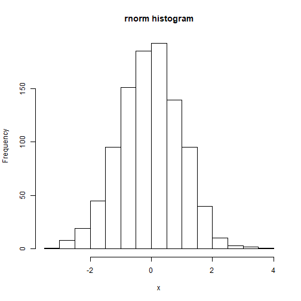

Distribution Functions Project
========================================================
author: Phoebe
date: 06 Feb 2018
autosize: true

INTRODUCTION
========================================================
This presentation addresses the shiny App developed for "Developed Data Product" course project. The peer assessed assignment has two parts:
* Shiny application and deploy it on Rstudio's servers.
* Slidify to prepare a reproducible pitch presentation.

The developed shiny application is avalilable at:

https://phoebza.shinyapps.io/shiny_project/

The presentation is available on:

http://rpubs.com/phoebza/shiny_Project

Source code for ui.R and server.R files are available on the GitHub: https://github.com/phoebza/slidifyProject


Shiny Apps Features & Functions
========================================================

The App has inputs on the sidebar panel, & output on main panel.<br/>
Input for the shiny App:
* radiobutton - to choose distribution type to observe
* slider - to control number of observation of dataset generated from radiobutton
* submitButton - to click once all changes have been made (used to not automatically update output)


Shiny Apps Features & Functions (cont.)
========================================================

Output - TABS:
* distribution fit on histogram graph from generated data from selected distribution type
* histogram graph from generated data from selected distribution type
* summary statistics of generated data
* raw generated data from the selected distribution type from radioButton


Data generated for rnorm
========================================================

Data generated for normal distribution for 986 observations

<style>
pre code, pre, code {
  white-space: pre !important;
  overflow-x: scroll !important;
  word-break: keep-all !important;
  word-wrap: initial !important;
}
</style>


```
  [1] -1.276296e+00 -1.709266e+00 -9.133145e-01 -8.450431e-02  5.368027e-01
  [6]  1.335685e+00 -1.160073e-01 -1.044385e-01 -9.969238e-01 -1.511816e-01
 [11]  1.907723e+00  6.227490e-01  1.059489e+00  2.662834e+00 -5.631206e-01
 [16] -8.047656e-01 -2.168109e-01 -8.099334e-01 -2.015332e-01  3.786363e-01
 [21]  1.443833e+00 -1.008690e+00  2.215554e-01 -2.026575e-01  3.840222e-01
 [26]  8.891591e-02  8.762206e-01 -1.239933e+00 -2.218570e-01 -6.650189e-01
 [31]  5.780087e-02  1.765253e+00  8.638950e-01 -9.519512e-01 -7.863724e-01
 [36]  2.080138e+00  1.335442e-01  1.440336e+00  2.624428e-01 -1.432612e-02
 [41] -6.692726e-01  4.059205e-01  2.730500e-01 -7.447763e-01  7.677344e-01
 [46] -4.010259e-01  6.091955e-01  3.277024e-01 -1.359578e+00 -8.018087e-01
 [51] -8.777469e-01 -6.637634e-01  4.749346e-01  4.108452e-01  5.370094e-01
 [56] -1.997373e+00 -1.169371e+00  5.936619e-01 -2.869487e-02 -1.133212e+00
 [61] -4.844906e-01  7.233314e-01  1.215655e+00  1.922739e+00  1.508342e+00
 [66] -5.456325e-01 -9.842015e-01  6.795555e-01 -9.216016e-01 -2.571371e-01
 [71]  3.014668e-01 -6.692696e-01  7.821733e-01 -7.110796e-01  4.928104e-01
 [76]  1.790606e+00 -7.215664e-01 -2.417280e-01 -2.799175e-01 -3.266127e-01
 [81]  2.091023e-01 -9.123134e-01 -5.755733e-01  1.285836e+00  6.022702e-01
 [86] -7.855124e-01  2.474788e-01 -6.701890e-01 -1.748043e+00 -4.938080e-01
 [91] -3.587611e-01  8.301973e-01  6.556035e-01  2.221512e-01  1.014141e+00
 [96] -1.671140e+00 -5.806820e-01 -8.450317e-02 -1.110608e+00  2.762340e-01
[101] -7.356234e-01 -1.759350e+00 -8.600487e-03  1.952389e+00 -2.527415e+00
[106] -1.763584e-01  5.456929e-01 -1.310911e-01  1.275745e+00 -5.452093e-02
[111] -4.749335e-01 -3.120027e-01  1.003384e+00  1.333606e+00  1.639817e-01
[116] -5.947675e-01 -7.095046e-02 -8.041614e-01  6.439856e-01  1.793024e-01
[121]  5.903216e-01 -2.776637e-01  1.197962e+00 -5.338479e-01 -1.497884e+00
[126]  7.944857e-02  1.945174e-01  2.849203e-01  1.391829e-01 -1.252712e+00
[131]  8.169691e-01 -8.077727e-01  2.017809e-01 -3.133285e-01 -8.591923e-01
[136]  3.908872e-01  1.422688e+00  6.332887e-01  6.684797e-01  2.157014e-01
[141] -1.433080e-01  4.676413e-01 -3.842123e-01  1.687585e+00  2.018927e+00
[146]  4.723707e-01  1.348316e-01  3.523207e-01  6.796028e-01 -1.379669e+00
[151]  6.137215e-01  1.163329e+00 -1.218499e+00 -1.021133e+00 -2.637995e+00
[156] -2.622705e+00 -2.024015e-02  8.040684e-02  1.326724e+00  1.766099e+00
[161] -6.693339e-01 -1.438464e+00 -5.423025e-01 -1.378272e-01  3.889032e-01
[166] -4.336753e-01 -1.178424e+00 -4.061571e-01 -3.754409e-01 -6.065979e-01
[171] -4.851316e-01 -1.849385e-01  4.077547e-01  1.009014e-02  3.876826e-01
[176]  9.454821e-01  3.959388e-01 -2.839184e+00  1.450845e+00 -9.115156e-01
[181] -1.894925e+00  8.785233e-01  7.314298e-01  4.575244e-01  1.932084e-01
[186]  1.739419e-01 -1.861177e+00 -5.150560e-01  8.511320e-01 -1.159642e-02
[191] -1.399777e+00  3.796614e-01  7.016912e-01  1.904183e+00 -5.496097e-01
[196]  3.110309e-01  9.363788e-01  5.706693e-01 -3.567004e-01 -5.954991e-02
[201] -1.300469e+00  2.150937e-01 -5.220785e-01 -7.685795e-02  9.365773e-01
[206]  6.968009e-01  1.462005e-01 -9.071302e-01  2.880614e-01  5.574858e-01
[211]  6.946313e-01 -8.933506e-01  1.696307e-01 -1.690038e-01  1.340388e+00
[216]  1.031996e+00 -6.105348e-01 -9.121666e-02 -9.392683e-01 -1.042723e+00
[221]  1.666926e+00  6.520620e-01 -3.539709e-01  1.492597e+00  3.141324e-01
[226] -9.437288e-01 -5.610016e-01  3.488619e-01  1.194601e+00 -5.322136e-01
[231] -6.695118e-01  1.433378e+00 -7.191461e-01  9.334618e-01  2.664366e-01
[236]  5.313500e-01 -3.714105e-01  3.393324e-01  1.126574e+00 -9.823388e-01
[241]  1.984045e-01 -1.452221e+00 -1.464804e-01 -2.889668e-01  1.879799e-01
[246] -5.700098e-01 -1.020378e+00  2.955705e-01 -3.168539e-01 -1.046100e+00
[251]  3.062075e-01  2.068153e-01  9.614515e-01 -1.012842e+00  1.208248e+00
[256]  5.407712e-01  2.497492e-01 -5.944981e-02  1.726790e+00  1.354846e+00
[261]  7.701600e-01  3.630275e-01  4.205058e-01  1.187064e-01 -1.238818e-02
[266]  4.707581e-01  2.707111e-01 -9.348762e-01 -6.487026e-01  2.323149e+00
[271]  1.181657e-01 -8.216297e-02  8.323145e-03 -1.276876e+00 -3.731264e-01
[276] -9.939682e-01  5.225021e-01  2.057967e-01 -5.929861e-02  1.330650e+00
[281] -9.496108e-02 -1.512081e+00  1.737454e+00 -9.991674e-01 -6.447800e-01
[286] -6.739970e-01  1.238214e-01  6.009629e-01 -1.350856e+00  2.025614e-01
[291] -7.181926e-02 -1.582613e+00 -1.677803e-01 -9.862183e-01 -2.545641e-01
[296] -9.130051e-01 -1.018816e+00 -1.548735e+00  1.362291e+00 -1.557504e-01
[301] -3.613530e-01  1.477092e+00  8.101798e-02  4.033432e-01  1.330676e+00
[306] -5.590626e-01 -8.312689e-01 -4.747973e-01  8.771385e-01 -9.186316e-01
[311] -2.242647e-01 -4.667355e-01 -1.476328e+00  7.086630e-01  7.669705e-01
[316] -3.667625e-01 -2.001477e+00  4.986844e-01 -9.688248e-01 -9.756710e-01
[321]  5.906998e-01  2.971693e-01 -9.203042e-02  4.631189e-01 -1.416669e+00
[326] -1.501043e+00 -1.861998e-01  4.139637e-01 -2.839593e-01  7.588299e-01
[331]  1.499513e-01 -1.709817e-01  1.021701e+00  9.050171e-03  2.339371e-01
[336]  1.277275e+00  6.475319e-01  4.857931e-01  1.382167e+00  2.372505e-01
[341] -1.436117e+00  3.583744e+00 -1.294462e+00 -9.258860e-01 -9.384833e-01
[346] -4.691758e-01 -1.298249e+00  4.459665e-01 -1.350393e+00  1.529279e+00
[351] -1.679747e+00  2.464634e+00  8.161633e-01 -9.072964e-01 -2.240256e+00
[356]  1.257943e+00 -1.311091e+00  5.763391e-01  1.071768e+00 -2.889538e-01
[361] -5.364338e-01  1.393531e+00  3.992305e-01  1.808106e+00  1.383897e+00
[366]  1.204242e-02  1.842307e+00  1.517820e+00 -5.290666e-01  1.736545e-01
[371]  1.740152e-01 -8.933223e-02 -2.324857e+00 -6.450505e-01 -9.381331e-02
[376] -1.125532e+00  4.351914e-01  9.487317e-02  1.767056e+00 -2.027759e+00
[381] -3.471153e-01  1.424707e+00  2.869370e+00  5.728268e-01 -1.557894e+00
[386] -4.599946e-01 -7.399839e-01 -5.773746e-01 -7.068597e-01  5.335166e-01
[391] -1.736708e+00  8.567588e-01 -1.538744e+00  5.843619e-01 -8.740021e-01
[396] -9.195715e-01 -3.891778e-02  9.088389e-01  1.053904e+00  4.275891e-01
[401]  1.765298e+00  6.735629e-01 -3.086621e-01  3.029390e-01  1.530975e+00
[406] -2.958665e-01  4.122982e-01  1.040347e+00  3.872682e-01 -7.754377e-01
[411]  6.079770e-01  3.527152e-01  6.190344e-01 -1.189599e+00  9.415016e-02
[416]  1.097810e+00 -8.540056e-01  6.685331e-01  3.027203e+00 -8.866513e-01
[421]  9.965074e-02 -2.519400e-01  2.609800e-01 -2.671708e-01  1.270795e+00
[426]  1.890325e+00 -1.016178e+00 -1.575557e+00 -2.158329e+00 -2.535385e-01
[431] -5.189704e-01  1.142580e+00  7.918924e-01 -2.330864e+00  1.322873e+00
[436]  2.263844e-01 -1.595508e+00  8.653451e-01  1.205964e+00  2.636671e-01
[441]  6.399244e-02 -9.495296e-01  8.154769e-01  3.161700e-01 -1.322166e+00
[446]  1.874578e+00 -8.855840e-01 -1.067897e+00 -1.077977e+00 -5.472883e-01
[451]  6.107872e-01  1.311227e+00  9.114218e-01  4.076109e-01 -1.572451e+00
[456]  2.295502e+00 -1.526500e+00 -3.346758e-01 -2.253176e+00 -1.493806e+00
[461]  1.047003e+00  8.590927e-01 -9.296878e-02  6.491394e-01  1.213360e+00
[466] -2.129704e-01  1.675045e-01 -1.554641e+00 -1.610878e+00 -2.040650e-01
[471] -1.136489e+00  1.047480e+00  5.932363e-01 -3.491533e-01 -1.012549e+00
[476] -4.860534e-01  1.277335e+00  8.867259e-01 -1.847864e+00  6.209727e-01
[481]  9.956131e-01  1.345309e+00 -4.465190e-01  1.664019e+00 -1.656410e+00
[486]  1.965754e+00  1.408676e+00  5.297335e-02  8.101215e-02  5.840621e-01
[491] -1.185735e+00 -4.254573e-01 -4.516196e-01  1.663477e-01 -6.640469e-01
[496]  1.285958e+00  6.228830e-01  9.055878e-01  7.577553e-01 -1.197710e-01
[501]  2.082369e+00  6.166142e-01 -2.134942e-01  1.110934e+00 -1.001811e+00
[506] -1.091127e+00 -2.480982e-01 -4.526845e-01 -6.357099e-01 -8.661685e-01
[511] -4.323298e-02 -1.181723e+00 -1.348349e+00  3.613585e-01 -6.881168e-01
[516] -2.152683e+00  1.531931e+00 -1.290221e+00  9.688676e-01 -3.686775e-01
[521] -3.416482e-01 -6.696683e-01 -1.271983e+00  8.197979e-01  9.707272e-01
[526]  3.980442e-01  1.483761e+00  4.587212e-01 -7.178921e-01 -1.112998e+00
[531]  9.509807e-01 -1.763160e-01 -2.976528e-01  1.914472e+00 -1.768258e+00
[536]  1.116525e+00  2.426776e+00  8.005453e-01 -1.958091e+00 -1.767483e+00
[541]  1.965924e+00  1.054944e+00  1.044277e+00 -5.013862e-01  1.391209e+00
[546] -2.175552e+00 -1.060033e+00  1.453391e+00 -4.694243e-01 -8.700513e-01
[551] -5.346595e-01 -1.169801e+00 -3.764235e-01  4.101534e-01 -2.657632e+00
[556] -1.813903e+00  3.964780e-01 -1.994458e+00 -6.838582e-01  1.415464e-01
[561]  6.351767e-02 -6.597240e-01  1.036207e+00 -8.979373e-01 -1.431651e+00
[566]  9.947763e-01 -6.972192e-02  5.534324e-01  4.756819e-01 -8.758957e-01
[571]  1.292018e+00  1.490852e-01 -1.231792e+00  4.341282e-01  7.520545e-01
[576]  3.604977e-01  1.571593e-01 -3.808951e-01  1.046296e+00 -5.974804e-01
[581] -2.525187e-01  4.385597e-01 -9.847061e-01  8.900187e-01  1.958278e-01
[586]  8.030540e-01 -1.240940e+00  9.592662e-01  9.639837e-01  4.569126e-02
[591] -1.597014e+00  1.907716e+00  2.407259e-01  7.132658e-01 -9.471751e-01
[596] -1.507239e+00  1.091139e+00 -2.295646e-01 -3.186867e+00 -1.331361e+00
[601]  1.362521e+00 -9.839341e-02 -3.666533e-01  1.487146e-02  3.194707e-01
[606] -8.897960e-02 -1.148103e+00  3.707761e-01 -2.116755e+00 -7.987029e-01
[611] -7.504463e-01  9.986692e-01 -1.188498e+00 -2.735493e-01 -5.774244e-01
[616] -4.079932e-01  9.681090e-01 -1.524061e-01 -2.480041e-01  9.477636e-01
[621] -2.802918e-01  2.652391e-01  9.151571e-01  1.581720e+00 -2.318617e+00
[626] -1.671490e+00  1.457077e+00  9.243509e-01  2.224873e-01  1.393484e+00
[631] -4.080670e-01 -1.534796e-01  1.547452e+00 -9.986975e-02  2.368578e-01
[636]  1.226790e+00  3.416267e+00  1.142298e+00  1.344245e-01 -6.619934e-01
[641] -6.072530e-01 -1.056257e+00  1.545525e-01 -1.179671e+00  7.285621e-02
[646] -1.102487e+00 -2.102743e-01  7.234169e-01 -1.090491e+00 -1.818295e+00
[651]  1.984701e-01  7.582440e-01 -3.838771e-02 -8.072191e-01 -1.879599e+00
[656]  6.835007e-01  3.674254e-01 -4.195802e-05 -1.373541e+00 -1.136539e+00
[661] -1.720392e+00  4.421778e-01 -8.748481e-02  2.628287e+00 -4.388236e-02
[666] -2.884691e-01 -8.345840e-02  1.423399e+00  4.423821e-01  2.111282e-01
[671]  2.048846e-01  7.660690e-02  1.131928e-01  1.309417e+00  1.068560e+00
[676] -1.713232e-01  5.324467e-02 -1.541222e+00  5.644523e-01 -1.445023e+00
[681] -2.061617e+00  9.557272e-01  9.350086e-01  2.251036e+00  1.416771e+00
[686] -2.379354e-01  1.754332e+00  7.349058e-01  2.935276e-01 -9.255588e-01
[691] -1.720380e+00 -2.864275e+00  1.061004e-01 -8.812303e-02 -6.601395e-01
[696] -1.034445e+00  1.083167e+00 -1.044585e+00  7.170080e-01  8.487032e-01
[701]  8.948599e-01  4.311879e-02 -3.347901e-01  2.376769e-01  1.590535e+00
[706]  8.479308e-01  2.232623e-01 -7.810298e-01 -1.240409e+00  5.302627e-01
[711]  4.007834e-01  3.718755e-02 -1.232266e+00 -2.323866e+00 -8.983331e-01
[716]  4.557887e-01  9.142258e-01  1.221908e+00 -5.592274e-02 -4.706277e-01
[721] -4.806751e-01  1.960698e-01 -6.046493e-01 -2.027131e+00  1.210381e+00
[726]  1.967257e+00 -1.463703e-01  1.889187e+00  7.006846e-01  6.162911e-01
[731] -1.338145e+00  2.839570e-01  1.868656e+00  7.281157e-01 -6.440667e-02
[736] -3.417341e-01 -9.689970e-01 -3.052644e-01 -1.234014e+00  1.002824e+00
[741]  3.720145e-03 -3.539321e-01 -3.722071e-01  7.990671e-01 -2.692923e-01
[746]  4.548011e-01  5.228609e-01  1.120634e+00 -2.984448e-02 -1.600011e+00
[751] -4.128178e-01 -1.446928e-01 -1.096922e-01 -7.807377e-01 -2.793631e+00
[756] -3.427258e-01 -1.239898e+00  1.195054e-02 -1.035268e+00 -1.031311e+00
[761]  1.235105e+00 -1.055934e-01 -1.385871e+00 -3.018791e-01  2.533192e-01
[766] -3.733024e-02  1.027409e+00 -1.073367e+00 -5.330614e-01  9.097543e-01
[771] -4.157961e-01  3.330850e-01  1.269984e+00  2.220143e-01  3.253549e-01
[776]  3.785020e-01 -7.382164e-01  3.990725e-01 -8.144189e-01 -8.429783e-01
[781] -1.447557e-01 -2.859247e-01 -9.145533e-02 -9.909391e-01  8.217999e-01
[786] -6.057635e-02 -2.287568e-01 -5.003410e-01 -4.742588e-01 -2.488308e+00
[791]  4.416258e-01 -5.471725e-01 -6.409017e-01 -4.280190e-01 -3.819251e-01
[796] -1.919315e+00  1.109909e+00  1.028899e-01 -1.541601e+00  2.403931e-01
[801] -8.265454e-01  3.378932e-01 -3.519570e-01 -1.017420e-01 -9.941601e-02
[806] -7.111873e-01 -9.275542e-01  3.822471e-01 -6.799627e-04 -1.296433e+00
[811]  2.232201e-01 -5.789659e-01  2.082028e-01  5.409810e-02  2.270505e-01
[816]  9.691727e-01  1.692921e-01  1.434045e+00 -2.463792e-01  9.659500e-02
[821]  5.638284e-01 -6.013653e-02 -7.283434e-01  5.879965e-01 -5.602731e-01
[826]  4.152424e-01  1.716407e-01 -2.010308e+00 -9.202764e-01 -5.441909e-01
[831] -1.351304e+00 -1.637071e+00  8.390069e-02 -8.501969e-01  5.833793e-02
[836] -9.883041e-01 -1.332688e+00  1.195913e+00 -6.315521e-01  3.418216e-01
[841] -4.914427e-01 -1.985857e-01  4.746111e-01 -1.981037e+00  6.694239e-01
[846]  1.081470e+00 -1.717606e+00  1.868647e-01  2.083182e+00  3.511265e-01
[851] -6.314732e-01 -1.197580e+00 -9.921447e-01 -4.016587e-01 -1.058985e+00
[856]  6.585620e-02 -4.043496e-01  1.077997e+00 -2.641602e-01 -1.118957e+00
[861] -8.633876e-01  8.084668e-01  2.378915e-01 -1.484651e+00  1.320801e+00
[866] -9.592216e-01 -2.094852e-03 -4.669274e-01 -6.459500e-01  1.323932e+00
[871]  6.742640e-01  6.758899e-01  1.697090e+00 -1.528850e-01  1.172836e-01
[876] -1.241294e+00  1.047615e+00  6.056147e-01 -1.529485e+00  1.197224e+00
[881]  3.581097e-01 -7.541483e-01 -1.142333e+00 -4.600278e-01 -4.037083e-01
[886]  1.468127e+00 -1.705232e+00  7.315627e-01 -5.600990e-02  4.322802e-01
[891]  2.348618e-01 -5.954532e-01  4.014287e-03 -5.317213e-01  1.077663e+00
[896]  1.517444e+00 -9.689011e-01 -1.040223e+00  1.158170e+00 -7.061895e-01
[901] -1.912360e-01 -2.180554e+00 -1.261763e+00 -2.706856e-01 -1.052017e+00
[906]  7.298657e-01  8.825573e-01 -8.709201e-01  5.442029e-01  6.040566e-01
[911]  2.048792e+00  2.748842e-01 -1.083500e+00  7.137156e-01  7.318639e-01
[916]  2.237784e-01  1.353152e+00  7.617301e-01  5.785234e-01  1.674207e+00
[921] -1.391410e+00  2.154727e-01 -2.278717e-02 -1.476983e+00 -9.348640e-01
[926] -1.190349e+00 -6.947514e-01  6.491098e-01 -2.149309e+00 -2.606361e+00
[931] -4.184395e-01 -6.641123e-01  4.986067e-01  1.361865e+00  9.568830e-01
[936] -1.276478e+00  1.819438e+00 -1.771406e-01 -1.585392e+00 -2.376577e-01
[941] -5.350250e-01 -6.971409e-02  5.840255e-01 -1.433607e+00 -5.431375e-01
[946] -8.198825e-01 -6.356018e-01  6.311569e-01 -3.005665e-01  3.843601e-01
[951] -6.403670e-01  9.479947e-03 -1.361650e+00 -7.402220e-01  4.759865e-02
[956] -6.356353e-01 -5.986885e-01  7.452347e-03 -4.780856e-01  1.270118e-01
[961] -5.126184e-02 -1.450364e+00  5.674686e-01 -1.509991e-01 -2.121208e+00
[966]  1.100738e+00 -4.263407e-01  6.431646e-01 -4.649333e-01 -7.632985e-01
[971]  1.797019e+00 -7.023223e-01 -3.146772e-01 -2.754346e-01  6.242426e-01
[976]  1.804819e+00  8.333199e-01 -1.331316e+00  1.948687e-02  1.297258e+00
[981]  4.376565e-01  9.798798e-01  1.177949e+00 -1.023196e-01  1.004690e-01
[986]  5.138022e-01
```


Histogram
========================================================



